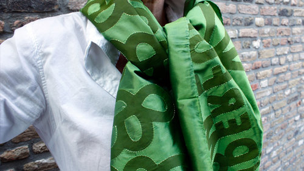

<site> Pepper+Tom

<logo>

<page index>

<background 3> 
<image 1>

<content>

# Products

# Skirts

<page home>

<content>
	
# Products

## Desirable products

Where do clothing and fabrics come from? Who made them and under what circumstances? Often there is no answer to these questions, even when asking them in expensive stores.

Wouldn’t it be nice to wear clothes where it is clear who made them? Where the conditions of fabrication are good and the trade is fair?  

Pepper+Tom wants that, sharing experience, collaborating with partners in the clothing chain, who think and act the same way. To make the production, resources and materials traceable for every garment. Pepper+Tom supports the idea of ‘true cost’ and ‘slow fashion’, adding to the pleasure of wearing the clothes.

# Skirts

Pepper+Tom skirts are perfect basic items that should not be missing in your wardrobe. They are designed in various sizes, fabrics (cotton, silk and wool) different lengths and delicately finished with a colored zipper. The skirts are made from sustainable fabrics. Semi couture by a Dutch Atelier. 

Confident women accentuate their individuality with their outfit. Cowboy boots under a fashionable skirt. High heals under a loose dress or pants. They combine stylish and tough. They choose for comfort above catwalk, appreciating beautiful and well-made garments. They opt for Pepper+Tom.

Quote’s by Pepper+Tom customers:
‘It’s a simple style, good model, clear!’
‘I can wear it all day, all night, everywhere’
‘Very flattering to many figure types’

Pepper+Tom would like to say to all women:
‘Just keep dancing!’

# Scarves

The scarves are the result of many peoples’ work and creativity from rural Bangladesh to the cities of the Netherlands and the shores of the United States.

Beautiful women of Bangladesh embroider the scarves by using the traditional Nakshi Kantha technique. The silk of the scarves is made of the best quality, Rajshahi Silk. The fabric is embossed in a workplace in Dhaka and embroidered in Dinajpur, a poor region in the northwest of Bangladesh.

All under supervision of Kumudini Welfare Trust of Bengal. This NGO is part of the World Fair Trade Forum and Ecota Fair Trade Forum. In 2008 they received the Award of Excellence for Handicrafts South Asia from Unesco.

Under the name of Generous Gesture, the scarves have won a Bronze Award for the European Design Award 2010 in the category ‘Self Initiated Projects’

Generous Gesture has been nominated for the German Design Award 2012.

# Notes

Pepper+Tom's Refuge
May 12, 2017
Retreat: Rediscover-, Redefine-, Release- and Remodel time, with a sense of humor.

Wellspring
April 25, 2017
Animated by quotes of Sir Francis Bacon (British painter 1909-1992)
“‘By far the best proof is experience’ ”
— Sir Francis Bacon

“In order for the light to shine so brightly, the darkness must be present”
— Sir Francis Bacon

Happy Easter
April 11, 2017
'It’s A Good Week To Have A Good Week And A Happy Easter'

# Contact

Love to hear from you...

Claudia Mens | claudia@petr.com 

mobile +31 6 41 367 689 | studio +31 15 887 1233

Rietveld 56 | 2611 LM Delft | The Netherlands

129  Indian Hill Road | 02575 West Tisbury Martha's Vineyard | USA

The company is registered in the Chamber of Commerce (Handelsregister Kamer van Koophandel), by name Buro Petr van Blokland + Claudia Mens, number 27237753 Delft. If you have a question not answered in this website, you can send an email (claudia@petr.com) and we will respond to you as soon as we can. 

# Studio

Pepper+Tom is initiated by Claudia Mens, located at Rietveld 56, 2611 LM in Delft, The Netherlands. 

Telephone mobile +31 6 41 367 689 or studio +31 15 887 1233

Pepper+Tom would never exist without a team of dedicated people. 

Claudia Mens claudia@petr.com  Designer, founder Pepper+Tom 

Petr van Blokland Typedesigner

Kirsten Langmuur Graphic designer

Liesbeth Oltmans Designer, consultant, trendwatcher

Djoeke Delnooz Model

Libby Ellis Creative director 

Sep Schaffers Text writer

Marlies Kromwijk Designer sustainability 

Petra Dijkgraaf Tailor

Suzanne Liem Photographer

Pendleton, Boweevil, Capsicum, Ecological Textiles and Bottger Fabric suppliers

Claudia Mens

I am the child of the woods.
We lived in a wooden house. At a dirt road.
Endlessly tinker with acorns.
Myself hiding under the ferns.
Preferably in a sweater and pants.
Wow, what a freedom, what a space.
Always together with other kids.

“Watching is a verb,” my mother would say “look at the world. Look how beautiful that portrait has been painted.”
I drew notebooks. Making atmospheres and environments, little peepshows. Then crept behind my mom’s Husqvarna sewing machine and sewed a wide comfy skirt. To climb into trees.

After three decades, running a studio from 1980 till 2010, it was time for something else. Claudia went looking and longing for the woods of her childhood. She found that feeling back on Martha's Vineyard in the USA, where she began drawing with childlike pleasure and painting. Arose leafs and fern motifs, inspired by her travels in Africa, South America and Asia.

She designed a series of scarves with type and motifs of leafs, produced by NGO Kumudini Welfare Trust in Bangladesh. In 2016, she started with a lot of spirit and fun Pepper+Tom.

Besides the products of Pepper+Tom, similar to work in all of the photo's on this website, design can be made by Claudia as a special custom assignment. Ask her: claudia@petr.com

# Stores

Unfold | Markt 27 | 2611GP Delft | The Netherlands | Telephone +31 15 214 11 51 | E-mail info@unfold-delft.nl | Site unfold-delft.nl

Brickyard | 19 Main Street | Vineyard Haven | United States | Telephone +1 508 338 2178 |  Site brickyardmv.com  